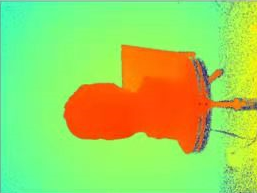
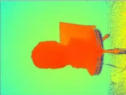

# filter
median_filter average_filter gauss_filter whith Cpp

- 三种滤波器的C++实现及比较
- 对于中值滤波采用全比较排序法
- 中值滤波法是一种非线性平滑技术，可以有效消除孤立噪声点
- 高斯滤波是一种线性平滑滤波，适用于消除高斯噪声。
- 对于均值滤波，作用有限，只是简单取均值，只能轻微地减弱噪声，有待进一步考量。

- 原图

- 3\*3 均值滤波

对于均值滤波，均值滤波是一种线性滤波器，处理思路也很简单，就是将一个窗口区域中的像素计算平均值，然后将窗口中计算得到的均值设置为锚点上的像素值。
该算法有优点在于效率高，思路简单。同样，缺点也很明显，计算均值会将图像中的边缘信息以及特征信息“模糊”掉，会丢失很多特征。

- 3\*3 中值滤波

- 中值滤波是一种非线性滤波，在处理脉冲噪声以及椒盐噪声时效果极佳，能够有效的保护好图像的边缘信息。
- 中值滤波的处理思路很简单，取卷积核当中所覆盖像素中的中值作为锚点的像素值即可。

- 3\*3 0.8 高斯滤波

- 高斯滤波是一种线性滤波，是常用的一种滤波算法，利用二维高斯函数的分布方式来对图像进行平滑。
高斯滤波的优点可以集中在高斯函数的特点上来看
1. 二维高斯函数是旋转对称的，在各个方向上平滑程度相同，不会改变原图像的边缘走向。
2. 高斯函数是单值函数，高斯卷积核的锚点为极值，在所有方向上单调递减，锚点像素不会受到距离锚点较远的像素影响过大，保证了特征点和边缘的特性。
3. 在频域上，滤波过程中不会被高频信号污染。
高斯模糊实质上就是一种均值模糊，只是高斯模糊是按照加权平均的，距离越近的点权重越大，距离越远的点权重越小。通俗的讲，高斯滤波就是对整幅图像进行加权平均的过程，每一个像素点的值，都由其本身和邻域内的其他像素值经过加权平均后得到。具体代码也可在后附连接中看到。
